# comfyui-jz

personal comfyui nodes, it sits in the `jz/` category so my nodes never mixes with the installed packs and they are easy to find.

when editing existing nodes, ONLY append widgets... so that old workflows still work

---

## contents

- [jz/api](#jzapi) : jz Gemini Generate,  jz OpenRouter VLM, ...
- [jz/image](#jzimage) : jz Composite Back, jz Seam Repair, jz Seam Carve, ...
- [jz/util](#jzutil) : jz String Picker, jz Fallback, jz Switch, jz Display JSON, ...

## the nodes

### jz/api

custom nodes using https calls, with retries on 429/5xx response, the (api) keys are resolved **server-side** (either in an `.env` or a `config.ini`) and should never be stored in workflows!

- **jz Gemini Generate**, *vertex* or *generativelanguage generateContent*. it works with zero images (text-to-image), single images, batches or a proper image list. when using `batch_size`, it fires **parallel calls** (shared token, with per-call retries). 
the outputs are the image plus a usage summary and total token count. **api key is the base64 encoded service account, stored in the `.env` as `SERVICE_ACCOUNT_BASE64=...`**.

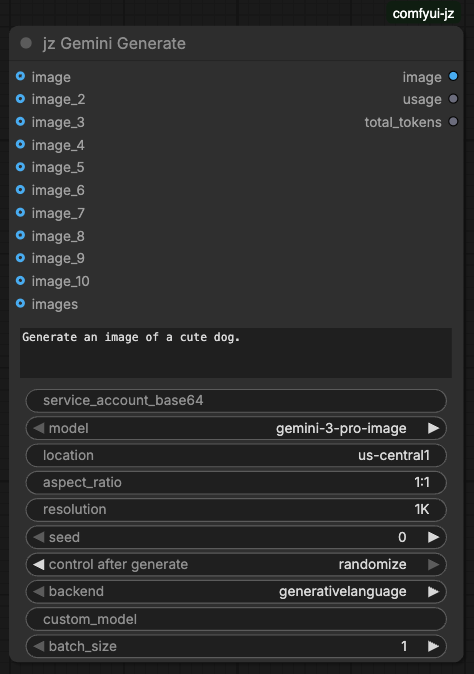

- **jz OpenRouter VLM**, vision/text through *openrouter*. it raises on errors instead of passing them downstream. also downscales images before upload (`max_edge`), and sends every frame of a **batch** as a separate image in one call (so "describe the two images" just works), and outputs the cost.
the `reasoning` widget defaults to `low` (reasoning models otherwise burn `max_tokens` on hidden thinking and return truncated answers).
**api key is stored in the `config.ini`, under the **[API]** router as `OPENROUTER_API_KEY=...`**

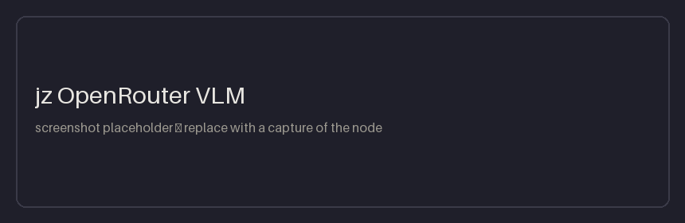

### jz/image

plain image ops (often image in image out), no API involved

- **jz Composite Back**, pastes the original back onto the generated image with feathered edges [**outpainting workflow**]

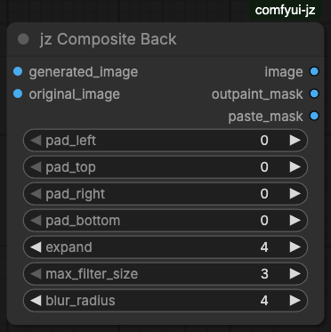

- **jz Seam Repair**, deterministically cleans leftover fill-color seams at the canvas edge [**outpainting workflow**]

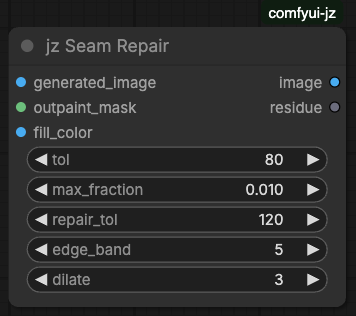

- **jz Pad Calculator**, picks the best supported aspect/resolution (for Nano Banana Pro) for an image and computes the padding to get there [**outpainting workflow**]

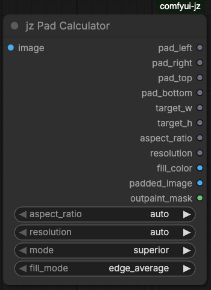

- **jz Resize Long Edge (list)**, normalizes a list or batch of mixed-size images to one long edge, outputs a list (of images)

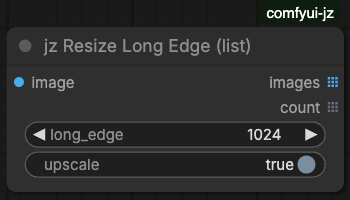

- **jz Seam Carve**, content-aware resize (Avidan-Shamir seam carving + forward energy, arXiv:2608.04329). carve or enlarge either dimension, protect/remove regions with MASK inputs. **numba-compiled** fast path when numba is installed, multi-frame batches carve in parallel.
note: forward energy algorithm will cut through flat uniform regions, protect the product with a mask when it matters!

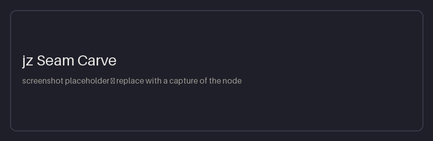

### jz/util

- **jz String Picker**, picks one string from a list (one per line or custom separator), random (seeded) or by wrapping index

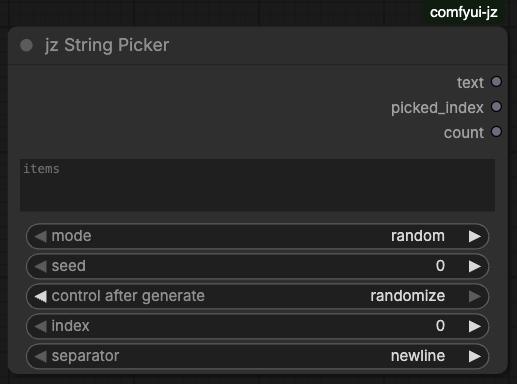

- **jz Fallback (lazy if/else)**, passes `primary` if present, otherwise evaluates `fallback`. the unused branch **never** executes

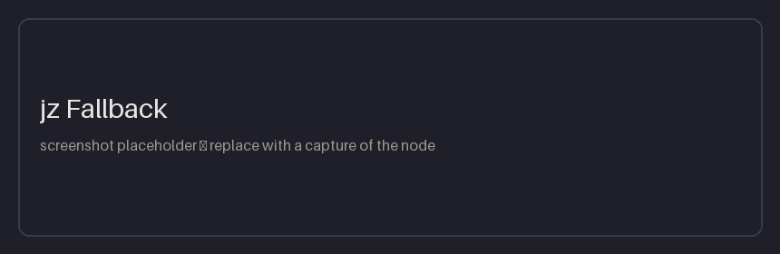

- **jz Switch (lazy if/else)**, boolean-driven: outputs `on_true` or `on_false` depending on `condition`, the other branch **never** executes. both branches are optional: if the selected one is not connected, downstream nodes are silently skipped (if true output the image, else output nothing)

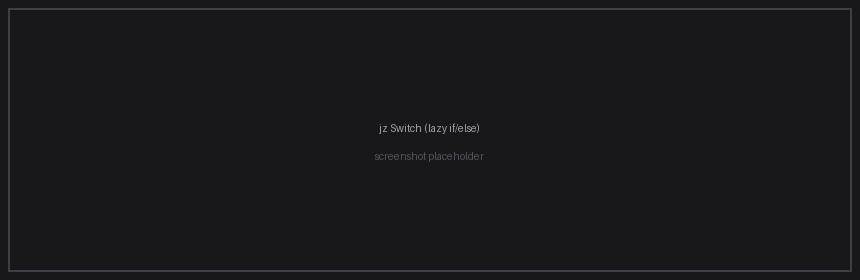

- **jz Display JSON**, takes a string of json and renders it in the node as a collapsible syntax-highlighted tree (copy button included). invalid json shows a parse-error banner + the raw text instead of killing the run. the view survives save/reload, and the prettified string passes through as output

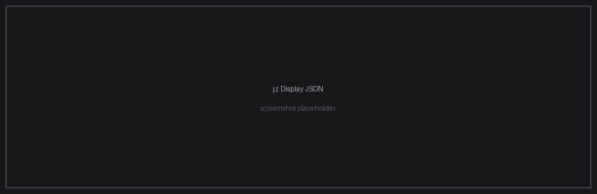