# comfyui-jz

personal comfyui nodes, in the `jz/` category so they never mix with the installed packs + they are easy to find. **26 nodes.**

when editing existing nodes, ONLY append widgets and outputs... so that old workflows still work. node **keys** are frozen too — a few still read `Gemini*` for that reason.

---

## contents

- [jz/api](#jzapi) (8) : Gemini Generate · OpenRouter VLM · OpenRouter Image · BytePlus Seedream · BytePlus Seedance · BytePlus Seedance Fetch · fal Image · fal Video
- [jz/image](#jzimage) (12) : Composite · Composite Back · Double Threshold · Edge Sizes · Image Sanity · Pad Calculator · Resize And Pad · Resize Long Edge · Resolution Selector · Seam Carve · Seam Repair · Before/After Slider
- [jz/sampling](#jzsampling) (1) : Shift Sigmas
- [jz/util](#jzutil) (5) : Choice · Display JSON · Fallback · String Picker · Switch
- [layout](#layout) : how the package is put together

## layout

`__init__.py` auto-discovers every `nodes/**/*.py` that exports `NODE_CLASS_MAPPINGS`, so **adding a node is dropping a file** — nothing to register. Files starting with `_` are skipped.

shared code lives in `common/` (never auto-discovered):

| module | |
|---|---|
| `secrets.py` | `resolve_key()` — every provider key resolves the same way: node input → env var → `.env` → `config.ini`. `openrouter_key()` / `byteplus_key()` are four-line adapters |
| `http.py` | pooled session, status-aware retries (408/429/5xx + Retry-After), `truncate_b64` for sane error messages |
| `images.py` | tensor ↔ PIL ↔ base64/data-URL, `pils_to_batch`, BT.601 `luma`, the shared `INTERPOLATION` list |
| `nodes.py` | node-authoring helpers: `AnyType`/`ANY` wildcard sockets, `ComboAny`, `scalar()` for `INPUT_IS_LIST`, `SEPARATORS`, `format_usd` |
| `model_cache.py` | model dropdowns served instantly from a 24h cache, refreshed on a background thread — `INPUT_TYPES()` never blocks on the network |
| `openrouter.py` / `byteplus.py` / `fal.py` | the per-provider adapters over that cache, plus each API's request shape |
| `gemini_dims.py` | the aspect-ratio × resolution → exact-size table, shared by three nodes |
| `fill_color.py` | padding-colour search (edge-average, and a colour provably absent from the image) |
| `google_auth.py` | service account → OAuth2 token |

`web/` holds the frontend extensions (`jz_choice.js`, `jz_display_json.js`).

## nodes

### jz/api

custom nodes using https calls, with retries on 429/5xx responses.

**keys are resolved server-side and must never be stored in workflows.** every node resolves the same way — the `api_key` widget (leave it empty!) → environment variable → `.env` at the pack root → `config.ini`. both files are gitignored:

| provider | env / `.env` | `config.ini` |
|---|---|---|
| openrouter | `OPENROUTER_API_KEY` | `[API] OPENROUTER_API_KEY` |
| byteplus | `BYTEPLUS_API_KEY` or `ARK_API_KEY` | `[BYTEDANCE] ARK_API_KEY` |
| fal.ai | `FAL_KEY` or `FAL_API_KEY` | `[FAL] api_key` |

⚠️ **byteplus keys are region-scoped.** a key issued for `ap-southeast` returns `401 AuthenticationError` on `eu-west` and vice versa — and byteplus words it as "the API key ... is missing or invalid", which reads like a key problem. make the `region` widget match the key. the node's 401 message now says this.
| gemini | `SERVICE_ACCOUNT_BASE64` (base64 of the service-account json) | — |

- **jz Gemini Generate**, *vertex* or *generativelanguage generateContent*. it works with zero images (text-to-image), single images, batches or a proper image list. when using `batch_size`, it fires **parallel calls** (shared token, with per-call retries).
the outputs are the image plus a usage summary and total token count. **api key is the base64 encoded service account, stored in the `.env` as `SERVICE_ACCOUNT_BASE64=...`**.
`aspect_ratio` and `resolution` are dropdowns, built from the same dimension table as jz Pad Calculator so they can't drift (minus `auto`, which is a pad-calculator fitting mode, not an api value). to drive them from a wire instead, use the `aspect_ratio_in` / `resolution_in` sockets — connected beats the dropdown, and the value is checked against the api's list before a request is spent on it

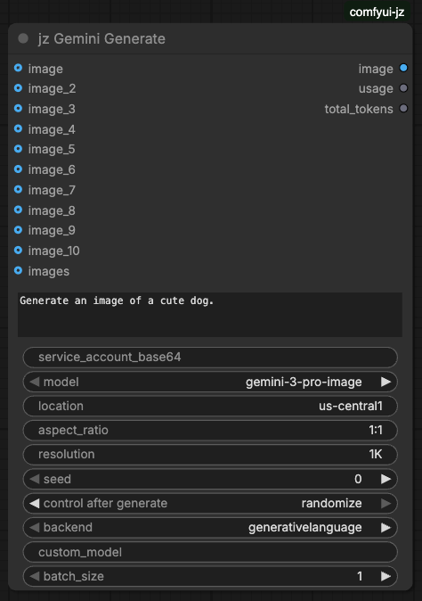

- **jz OpenRouter VLM**, vision/text through *openrouter*. it raises on errors instead of passing them downstream. also downscales images before upload (`max_edge`), and sends every frame of a **batch** as a separate image in one call (so "describe the two images" just works), and outputs the cost.
the `reasoning` widget defaults to `low` (reasoning models otherwise burn `max_tokens` on hidden thinking and return truncated answers).
**api key is stored in the `config.ini`, under the **[API]** router as `OPENROUTER_API_KEY=...`**

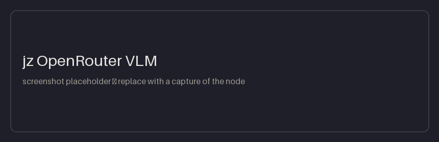

- **jz OpenRouter Image**, image **generation and editing** through openrouter. a separate node from the VLM one because it's a different api, not a mode of it: `POST /api/v1/images` (not `/chat/completions`), a `prompt`/`n`/`aspect_ratio`/`resolution` body, images back as `data[].b64_json`, and its own model catalogue at `/api/v1/images/models` that doesn't overlap `/api/v1/models`.
wire an IMAGE in and every frame becomes an `input_references` entry — that's how editing / img2img works here. outputs the IMAGE batch plus the cost and a usage json.
**`auto` on a widget omits that field entirely** rather than sending a default: supported parameters vary sharply per model — `resolution` doesn't exist on `gpt-5-image` or `flux.2-pro`, `n` caps at 1 for most models but 10 for `gpt-5-image`, `seed` is unsupported on `gemini-3-pro-image`. 
> **model dropdowns** on the openrouter and byteplus nodes are the **live catalogue**, cached to a gitignored `models_cache.json` (24h) and refreshed on a background thread — `INPUT_TYPES()` never blocks on the network, so a slow or unreachable provider can't stall comfyui startup or break node registration offline. curated favourites stay pinned at the top and `custom` reaches anything not listed. byteplus is filtered by `task_type`, not `modalities` (which is incomplete upstream — a live model can have no `output_modalities` at all).

**watch the cost**: these models bill per output *token*, not per image. a 1024x1024 from `gpt-5-image-mini` (the cheapest) is ~4160 image tokens ≈ **$0.033** — the per-token figure in openrouter's model listing looks tiny but multiplies fast, and the bigger models are ~15x that. the `cost` output reports what each call actually charged

- **jz BytePlus Seedream (image)**, the official byteplus modelark image api (`ark.ap-southeast.bytepluses.com/api/v3`, `eu-west` too). synchronous, ~8s. `1k`/`2k`/`4k` or a custom WxH (921,600–16,777,216 px), `n` images per call, and wiring an IMAGE in makes every frame a reference — that's how editing and multi-reference blending work.
parameter support varies per model and **is** enforced (`seedream-4-0` rejects `output_format`; `dola-seedream-5-0-pro` rejects `4k`), so only what you actually set is sent. the api's watermark default is **on**, so the node always sends the flag explicitly. billing is per output token, exact in `usage`

- **jz BytePlus Seedance (video)**, submits a generation task, polls it, and returns a native **VIDEO** — a 5s 1080p clip decoded to an IMAGE batch would be ~3 GB. also outputs `task_id` and `applied`.
⚠️ **this is the node that validates hardest, and here is why.** seedance parameters ride as text flags on the prompt (`--rs --rt --dur --fps --wm --cf --seed`), and the server validates **only** `--resolution` and `--duration`. every other flag — and any unknown flag — is **silently ignored and still billed**: a typo'd `--ratio` buys a perfectly valid, completely wrong video. worse, a running task **cannot be cancelled** (`DELETE` → `409`), so the charge is committed the moment the POST returns.
so: flags are whitelisted client-side before anything is sent, the token cost is printed first, `seed` is deliberately **not** `control_after_generate` (a re-queue would spend again), billable POSTs are sent **once** with no retries (a retried submit whose first attempt landed bills twice), and `applied` echoes the parameters the server really used so a dropped flag is visible instead of silent.
cost is per token: 1080p/16:9/5s/24fps = 246,840 tokens ≈ **$0.62** on `seedance-1-0-pro`

- **jz BytePlus Seedance Fetch (by task id)**, picks a job up by its `cgt-…` id. reads are free and tasks live **48h**, so a graph that errors after the spend is fully recoverable — and a job that outran `poll_timeout` is not money lost

- **jz fal Image** and **jz fal Video**, [fal.ai](https://fal.ai) through its queue api (`queue.fal.run`, `Authorization: Key …`). key from `FAL_KEY` in `.env` or `[FAL] api_key` in `config.ini`. no `fal-client` dependency — the rest is small enough for the pack's own http layer.
fal has **~1500 models and every one takes different arguments**, so model-specific parameters go in a `params` json widget rather than a fixed widget set. what makes that safe: fal publishes **each model's openapi schema, free and unauthenticated**, so the node validates against the real schema *before anything billable is sent* — a typo'd key, a bad enum, a wrong type or a missing required field raises locally and lists what's allowed. the console also prints the model's accepted parameters so you don't have to go look them up.
the schema also decides how a wired IMAGE is sent: models declaring `image_urls` get every frame, `image_url` gets the first, and a text-to-image model that takes no image at all says so instead of being sent an argument it would reject. both nodes take a **batch or a LIST**, so one call either way.
**fal can cancel a running job**, so a request that outruns `poll_timeout` is cancelled rather than left billing. billable submits are sent once with no retries. video returns a native VIDEO plus the `request_id`

### jz/image

plain image ops (often image in image out), no API involved

- **jz Composite Back**, pastes the original back onto the generated image with feathered edges [**outpainting workflow**]

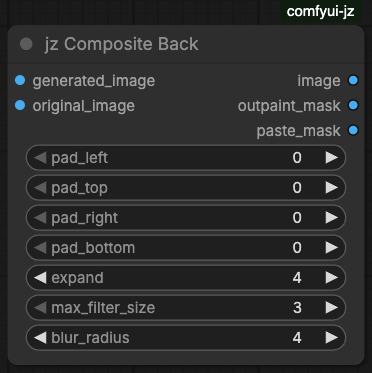

- **jz Seam Repair**, deterministically cleans leftover fill-color seams at the canvas edge [**outpainting workflow**]

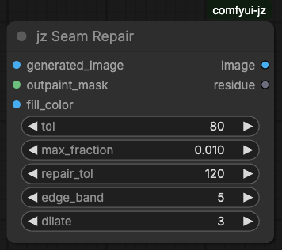

- **jz Pad Calculator**, picks the best supported aspect/resolution (for Nano Banana Pro) for an image and computes the padding to get there [**outpainting workflow**]

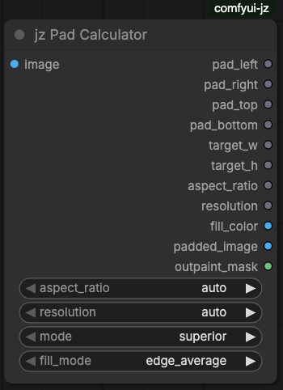

- **jz Resize Long Edge (list)**, normalizes a list or batch of mixed-size images to one long edge, outputs a list (of images). `interpolation` picks the resample method (same five as jz Resize And Pad); a frame already at the target size is passed through untouched, and alpha is preserved
the appended **`batch`** output is the same frames as one tensor, for nodes that need a real batch rather than a list. a tensor can't hold mixed sizes, so each frame is centred on the smallest canvas that fits them all and the rest is padded opaque black — **uniform inputs are padded not at all**, the batch is just a stack. an RGBA beside an RGB levels the RGB up with an opaque alpha.
note the two outputs are for different things: feed **`images`** (the list) to anything that takes images one at a time, and **`batch`** where a single tensor is required. for api reference images prefer the list — the byteplus nodes take it directly, and padding bars would otherwise be uploaded for the model to see

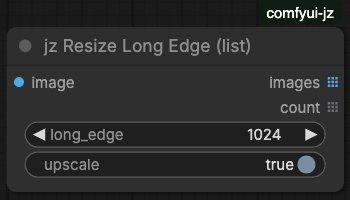

- **jz Seam Carve**, content-aware resize (Avidan-Shamir seam carving + forward energy, arXiv:2608.04329). carve or enlarge either dimension, protect/remove regions with MASK inputs. **numba-compiled** fast path when numba is installed, multi-frame batches carve in parallel.
note: forward energy algorithm will cut through flat uniform regions, protect the product with a mask when it matters!

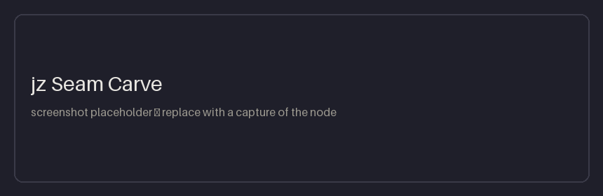

- **jz Edge Sizes**, outputs the long and short edge of an image as INTs (width/height sorted, orientation-agnostic)

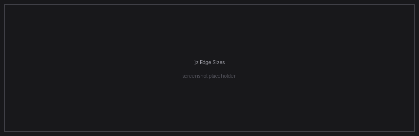

- **jz Composite**, pastes a source image onto a destination at a named anchor (center, corners, edge midpoints) with x/y offset and a border margin. optional MASK blends the source through it (a 4-channel source blends through its own alpha). no scaling — resize upstream. raises if the source doesn't fit

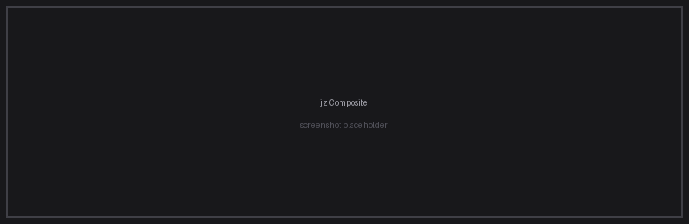

- **jz Double Threshold**, two-sided binarization: luma above `high` goes white, below `low` goes black, the band in between goes transparent. outputs the RGBA image (feeds jz Composite's alpha blending directly), a trimap MASK (1/0.5/0) and the decided-pixels alpha MASK

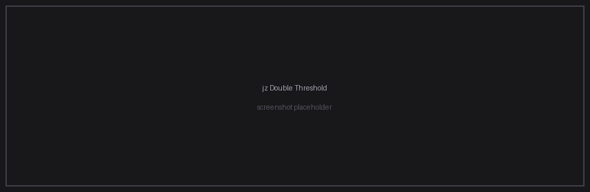

- **jz Image Sanity**, flags degenerate frames — empty (0 px, always checked), flat, too dark, too bright, fully transparent — each check toggleable with its own threshold. it **never raises** on a bad frame: it measures and reports, so you branch on `ok` with jz Switch / jz Fallback and decide yourself whether that means retry, substitute or skip.
flatness is measured **per channel** (a flat red frame has channel stds of 0 but a whole-tensor std of ~0.47, so a single global std would call it textured). takes a batch or an image list, and the per-frame outputs (`image`, `ok`, `reason`, `std`, `mean`) are **lists** — one verdict per frame; `report` (json, feeds jz Display JSON) and `all_ok` are scalars for whole-batch decisions

- **jz Resize And Pad**, comfyui's own *Resize And Pad Image* with the padding colour set free — it only offers white or black. same fit-and-centre (`min(tw/w, th/h)`, always scale to fit), but `padding_color` takes `#rrggbb` / `#rgb` / `black` / `white`, or wire a solid-colour image into `color_image` (jz Pad Calculator's `fill_color`) and it's sampled from there. also outputs the padding region as a **MASK** (1 = bar, 0 = image), and channels are preserved — an RGBA input stays RGBA with the padding opaque.
note: `interpolation` defaults to `lanczos`, which round-trips through 8-bit in comfy's implementation; pick `area` or `bicubic` to stay in float. a frame that already matches the target is passed through untouched rather than resampled

- **jz Resolution Selector**, aspect ratio → width/height. comfyui's core *Resolution Selector* labels its options `16:9 (Widescreen)` and takes a **COMBO**, which no STRING output can connect to — so it can't be driven from jz Pad Calculator. this one uses plain ratios, and `aspect_ratio_in` is a STRING socket you can actually wire (connected beats the dropdown; it also accepts the core node's parenthesised form).
`mode` picks how the size is computed: `table` returns the exact dimensions gemini emits (straight from the same DIMENSION_MAP as jz Pad Calculator, 10 ratios — core has 8, this adds `4:5` and `5:4`), `megapixels` uses core's own formula for any ratio and any target. they differ slightly on purpose: 16:9 at 1 MP is `1368x768` by the formula but `1376x768` in the table

- **jz Before/After Slider**, animates a wipe between two images: a divider sweeps across revealing `after` over `before`, holds, sweeps back — so the batch **loops seamlessly**. outputs the frames as an IMAGE batch (plus `frame_count` and `fps`), so you pick the encoder: `VHS_VideoCombine` for a gif, or core's `SaveAnimatedWEBP` / `SaveAnimatedPNG` / `SaveWEBM`. frames stay editable, so you can composite a caption on them first.
timing is two numbers — `sweep_seconds` and `hold_seconds` (the start-end hold is split across the loop seam, so a looping player dwells equally at both ends). `scale` resizes both inputs first: it's the lever on output size, and the handle scales with it (`1.0` skips resampling entirely). `orientation` switches to a horizontal divider. mismatched input sizes raise — match them with jz Resize And Pad

### jz/sampling

- **jz Shift Sigmas (flow match)**, applies the resolution-dependent shift that flow-match models use, to a SIGMAS tensor:
`mu = base_shift + (max_shift - base_shift) * (tokens - min_tok) / (max_tok - min_tok)`, then `sigma = e^mu / (e^mu + 1/t - 1)`, with `tokens = (W/16) * (H/16)`.
comfyui has both halves but never the combination — `ManualSigmas` emits explicit sigmas with **no** shift, and `ModelSamplingFlux` computes the identical mu (and the identical token count) but patches the **MODEL**, not a SIGMAS output. so there's no built-in way to take a schedule and shift it; this is that missing step.
one node covers the families, which differ only in constants: **flux** `max_shift 1.15, max_tokens 4096`, **qwen-image** `max_shift 0.9, max_tokens 8192`. wire `ManualSigmas` -> this -> `SamplerCustom`; with `1.0, 0.9375, 0.875, 0.75, 0.5, 0.25` it reproduces qwen-image viggle-turbo exactly.
resolution comes from the `width`/`height` widgets, or from a connected LATENT (which uses the latent's own `downscale_ratio_spacial`). the `mu` and `tokens` outputs are there because a wrong token count is otherwise *silently* wrong. `append_zero` adds the terminal 0 samplers need, since `ManualSigmas` doesn't

### jz/util

- **jz String Picker**, picks one string from a list (one per line or custom separator), random (seeded) or by wrapping index

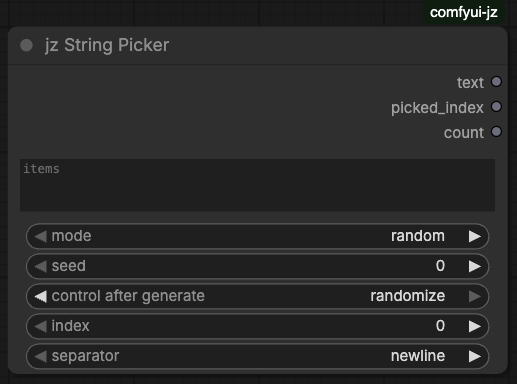

- **jz Fallback (lazy if/else)**, passes `primary` if present, otherwise evaluates `fallback`. the unused branch **never** executes

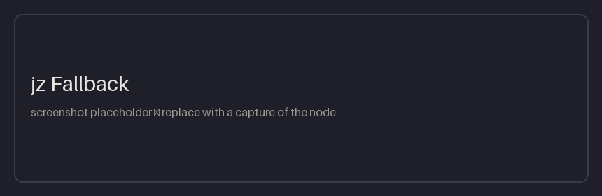

- **jz Switch (lazy if/else)**, boolean-driven: outputs `on_true` or `on_false` depending on `condition`, the other branch **never** executes. both branches are optional: if the selected one is not connected, downstream nodes are silently skipped (if true output the image, else output nothing)

- **jz Display JSON**, takes a string of json and renders it in the node as a collapsible syntax-highlighted tree (copy button included). invalid json shows a parse-error banner + the raw text instead of killing the run. the view survives save/reload, and the prettified string passes through as output

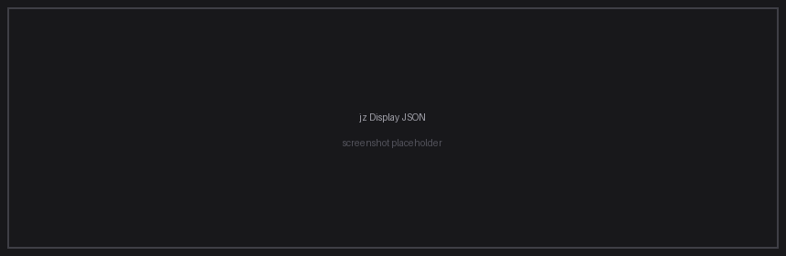

- **jz Choice**, picks from a list of choices (STRING input, one per line or another separator) by NAME — reordering the list upstream never silently changes the pick, it either still matches or raises listing the options. when the choices come from a string-literal node, the `choice` widget turns into a real dropdown (live-refreshed); with runtime-computed choices it stays a text field. outputs the value and its index

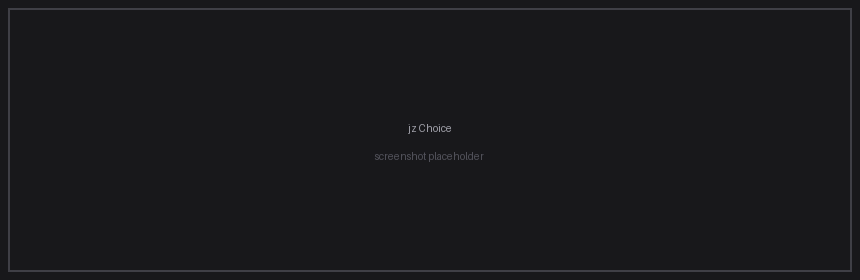

---

## screenshots

the older nodes have one; these don't yet — drop a `screenshots/<name>.png` in and add an `!\[name\](screenshots/name.png)` line:

`jz_openrouter_image` · `jz_byteplus_seedream` · `jz_byteplus_seedance` · `jz_byteplus_seedance_fetch` · `jz_image_sanity` · `jz_resize_and_pad` · `jz_resolution_selector` · `jz_before_after_slider` · `jz_shift_sigmas`
